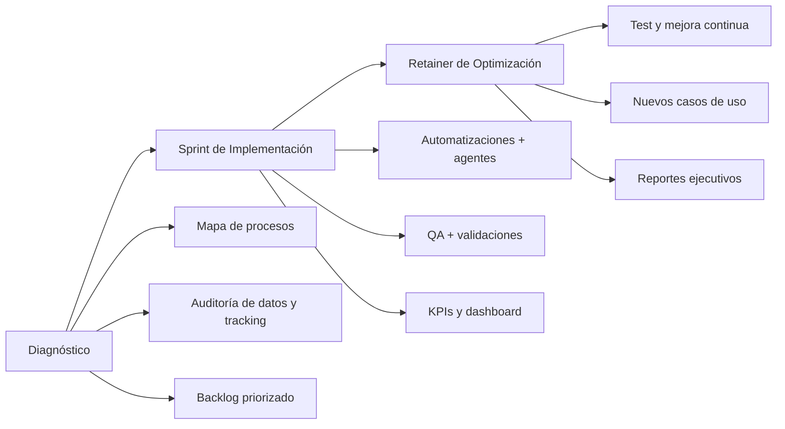

# Plan Maestro para el sitio web de tu agencia de marketing impulsada por IA

## Estrategia y narrativa B2B del sitio
Tu web debe vender como lo haría un buen SDR + un buen consultor: claridad inmediata, evidencia creíble y un camino sin fricción hacia la siguiente acción. En B2B, el “primer vistazo” decide si el usuario entiende qué haces y si vale la pena seguir explorando; por eso el home debe comunicar propósito y propuesta de valor “a golpe de vista”, sin obligar a adivinar. citeturn1search0turn1search13turn3search4

Además, el contexto de compra está cambiando: Forrester proyecta que más de la mitad de las compras B2B grandes (≥ US$1M) se procesarán mediante canales digitales de autoservicio (sitio del proveedor, marketplace, etc.). Esto refuerza que tu web no es solo “marketing”: es parte del canal transaccional (decisión, comparación, calificación y reserva). citeturn3search0

La narrativa central debe girar alrededor de **“Sistemas”** (operativos y medibles), no “servicios sueltos”. Para evitar sonar genérico (“hacemos IA”), define **3–5 sistemas productizados**, cada uno con: problema que resuelve, entradas/salidas, plazo de implementación (Sprint), y transformaciones medibles (ej., reducción de tiempo manual, aumento de leads calificados, velocidad de respuesta, tasa de recuperación). La usabilidad B2B se vuelve crítica porque el comprador necesita investigar, justificar internamente y comparar opciones. citeturn3search1turn2search6

## Arquitectura de información y estructura de páginas
Estructura el sitio como una “biblioteca de sistemas” + un embudo de diagnóstico. Esto alinea tus 3 objetivos: portafolio visual, educación con flujos interactivos y captación de leads de alto valor. Las pautas de diseño de homepage de Nielsen Norman Group recomiendan tratar el inicio como un “elevator pitch”: explicar quién eres, qué haces y qué puede lograr el usuario en el sitio. citeturn1search0

Propuesta de mapa de navegación (minimalista, pero profundo):

- **Inicio** (hero + sistemas + prueba social + CTA a Auditoría de IA)
- **Sistemas** (índice)  
- **Sistema (detalle)**: una página por sistema (tipo “product page” + “case study”)  
- **Agentes (Demos)**: biblioteca de demostraciones interactivas y “trazas” explicadas  
- **Casos / Resultados**: historias, métricas, antes/después, stack utilizado  
- **Auditoría de IA**: landing de captación + calificación + agenda  
- **Sobre nosotros**: credenciales, metodología, valores, seguridad/privacidad  
- **Recursos** (opcional): playbooks, guías, artículos técnicos de automatización (para SEO y autoridad)

En B2B, la credibilidad aumenta cuando el sitio muestra trabajo real y “cómo piensas” (casos, metodología, ejemplos verificables). Nielsen Norman Group y análisis de credibilidad B2B enfatizan el valor de casos para educar y respaldar ventas con ejemplos falsables. citeturn3search1turn3search7

## Diseño de la propuesta visual: Hero, “Sistemas” y prueba social
Tu hero no debe vender “IA”, debe vender **resultado + mecanismo + quién**. Para maximizar comprensión y reducir rebote:

**Hero (estructura recomendada)**  
- **Titular**: resultado dominante (p. ej., “Automatizamos marketing y ventas para que cierres más con menos operación manual”).  
- **Subtítulo**: mecanismo concreto (“Sistemas de automatización y agentes de IA + sprints de implementación + retainer de optimización”).  
- **Prueba rápida**: 2–3 micro-evidencias (logos, métricas, certificaciones, o “X sistemas desplegados”).  
- **CTA primario**: “Solicitar Auditoría de IA”  
- **CTA secundario**: “Ver Sistemas”

Este enfoque está alineado con principios de homepage: claridad inmediata de propósito y orientación a tareas (qué hace la empresa y qué puede hacer el usuario ahora). citeturn1search0turn1search13

**Sección “Sistemas” (no servicios)**  
Modela tus ofertas como sistemas con nombres memorables (para productizar y vender por paquetes). Ejemplos de “sistemas” coherentes con tu modelo Diagnóstico → Sprint → Retainer:

- **Sistema de Captación y Conversión**: landings + tracking + tests + handoff a CRM.  
- **Sistema de Follow-up Automático**: enriquecimiento, ruteo, secuencias, SLA de respuesta.  
- **Sistema de Creatividades y Experimentación**: generación/iteración de anuncios + repositorio de hooks.  
- **Sistema de Reporting Ejecutivo**: resumen semanal, alertas de anomalías, insights accionables.

Cada card de sistema debe “prometer” una transformación (output) y permitir profundizar en: blueprint, demo del agente, y resultados (si existen).

**Testimonios y prueba social (orden y colocación)**  
Coloca prueba social cerca de los CTAs principales y en cada página de sistema. En B2B, el usuario necesita señales de credibilidad para justificar la compra y reducir riesgo percibido. citeturn3search1turn2search6

## Demos interactivas de agentes y flujos de trabajo
Aquí ganas autoridad técnica y reduces fricción comercial: conviertes algo abstracto (“agentes”) en algo visible y evaluable (“así opera el sistema”). Este componente es tu mayor diferenciador si está bien hecho.

image_group{"layout":"carousel","aspect_ratio":"16:9","query":["node-based workflow builder UI diagram","AI agent workflow visualization dashboard","marketing automation workflow flowchart UI","B2B agency website hero section minimal design"],"num_per_query":1}

### Patrones de demo que suelen funcionar en B2B
Diseña las demos como “experiencias guiadas” (no como juguete). Tres formatos complementarios:

**Demo tipo “Blueprint interactivo” (clickable)**  
Un diagrama donde cada nodo explica: objetivo, inputs, herramientas, validaciones, fallback humano, y salida. Para implementarlo en web con interacción real, una librería típica es React Flow (UIs basadas en nodos y diagramas interactivos). citeturn2search0turn2search7

**Demo tipo “Trace / ejecución paso a paso” (tipo auditoría)**  
Muestras una “traza” de ejecución con datos ficticios:  
1) entra lead → 2) se clasifica → 3) se enruta → 4) se dispara secuencia → 5) se crea tarea en CRM → 6) se notifica.  
Esto educa y también comunica gobernanza (qué se automatiza, qué no).

**Demo tipo “Simulador con datos de ejemplo” (controlado)**  
Un pequeño formulario donde el visitante introduce un caso (p. ej., “tengo leads de LinkedIn y quiero responder en 2 minutos”). El sistema devuelve un blueprint recomendado, un SLA y un “plan de Sprint”.

### Cómo documentar flujos sin que se vuelvan inmantenibles
Combina dos capas:

- **Diagramas “living-docs”** con Mermaid (texto versionable en Git, fácil de mantener en equipo). citeturn2search5turn2search16turn2search28  
- **Diagramas interactivos** (React Flow) para los “momentos de venta” y educación interactiva. citeturn2search0

Ejemplo de flujo (para tu contenido educativo) usando Mermaid:

Los flowcharts y diagramas son un caso de uso central de Mermaid, precisamente orientado a explicar procesos y relaciones de forma mantenible. citeturn2search20turn2search12

## Pila tecnológica recomendada y arquitectura del producto web
La pila debe optimizar tres cosas: performance, capacidad de interacción (demos) y mantenibilidad (sistemas + casos como contenido).

### Frontend y rendering
Recomendación principal: **Next.js (App Router) + React + TypeScript + Tailwind**.

- **React** se describe como librería para construir interfaces (UI) por componentes, lo cual encaja con un sitio modular (sistemas, cards, páginas de sistema, bloques de prueba social reutilizables). citeturn4search4turn4search12  
- **Next.js App Router** usa características modernas de React (Server Components, Suspense, etc.) y permite un enfoque híbrido (server/client) útil para performance y SEO en un sitio de agencia. citeturn4search7turn4search3turn4search11  
- Next.js documenta estrategias de rendering como SSR/SSG/CSR y opciones de despliegue (Node, Docker, export estático con limitaciones). Esto te deja decidir por página: Home y Sistemas en estático/ISR, demos en client components y páginas con datos dinámicos donde corresponda. citeturn1search12turn1search19turn1search22turn4search6turn1search33  
- **Tailwind CSS** se define como framework “utility-first” (clases utilitarias) para componer diseños directamente en el markup, muy útil para construir y mantener un design system consistente sin CSS artesanal disperso. citeturn4search9turn4search13turn4search16  

### Contenido y “portafolio de sistemas”
Tu contenido debe ser fácil de producir y actualizar (sistemas, casos, demos, recursos). Dos enfoques típicos:

- **MDX en repositorio** (contenido versionado con Git): ideal si quieres que el contenido técnico (blueprints, flujos Mermaid, changelog de sistemas) evolucione como software. Mermaid se presta especialmente a “docs vivas” por su naturaleza textual. citeturn2search16turn2search12  
- **CMS headless** (si planeas publicar mucho y delegar edición): válido, pero cuida performance y revisiones.

### Demos interactivas (módulo “Agentes”)
- Para diagramas interactivos tipo blueprint: React Flow (nodos/edges, interacción y ejemplos reutilizables). citeturn2search0turn2search7  
- Para documentación interactiva “estilo API” (si ofreces integraciones o quieres mostrar endpoints / webhooks): herramientas basadas en OpenAPI como Swagger UI pueden generar UI interactiva. citeturn2search1turn2search35  

### Hosting, despliegue y previews
Si buscas velocidad de despliegue, previews por PR y un flujo estándar de equipo, un camino común es desplegar en entity["company","Vercel","web deployment platform"], cuyo stack y documentación enfatizan integración con proveedores Git y URLs de preview por commit/PR. citeturn4search2turn4search10turn4search21  
Para repositorio y colaboración, entity["company","GitHub","code hosting platform"] encaja con un modelo de “contenido como código” (MDX + Mermaid + versiones de sistemas). citeturn4search10turn2search28  

## UX/UI, accesibilidad, performance y seguridad
Aquí está la diferencia entre un “sitio bonito” y un “sitio que convierte” en B2B.

### Claridad y usabilidad B2B
- El home debe explicar propósito y ruta de acción rápidamente; NN/g lo plantea como principio fundamental. citeturn1search0  
- En B2B hay ciclos largos y necesidades de investigación; la web debe soportar exploración, comparación y justificación interna (por eso necesitas páginas de “sistema” profundas, no solo landing superficial). citeturn3search1turn2search6  

### Accesibilidad como estándar (y como señal de calidad)
Toma **WCAG 2.2** como baseline. WCAG 2.2 es una recomendación del entity["organization","World Wide Web Consortium","web standards body"] y define principios y criterios verificables (niveles A/AA/AAA). citeturn0search0turn0search4turn0search26

En UX/UI, esto se traduce en decisiones prácticas: contraste, focus visible, navegación por teclado, jerarquías claras, formularios con mensajes de error útiles y componentes interactivos accesibles (clave para tus demos). citeturn0search4turn0search16

### Performance como palanca de conversión y SEO
Tu sitio compite por atención y confianza; la performance es parte de la experiencia. Los Core Web Vitals (LCP, INP, CLS) son métricas definidas y documentadas por entity["company","Google","search and web company"] y web.dev, con umbrales orientativos (p. ej., LCP 2.5s, INP 200ms, CLS 0.1). citeturn0search13turn0search1turn0search30  
Además, Google documenta su relación con resultados de búsqueda y herramientas de medición; esto agrega un incentivo extra para optimizarlos. citeturn0search9

### Seguridad: lo mínimo profesional
Aunque tu web sea “marketing”, si integra formularios, calendarios, APIs o analítica, debes aplicar prácticas de seguridad web estándar. El entity["organization","OWASP","appsec nonprofit"] Top 10 es un documento de referencia para riesgos críticos en aplicaciones web. citeturn1search2turn1search8  
En el contexto de tu sitio: validación de inputs, protección contra inyecciones, control de accesos en paneles internos y hardening de configuración son medidas alineadas con categorías conocidas del Top 10. citeturn1search28turn1search36

## Embudo Diagnóstico → Sprint → Retainer con “Auditoría de IA” y agendamiento
Tu embudo debe funcionar como un sistema (coherente con tu posicionamiento): calificar, demostrar valor, y cerrar el siguiente paso sin fricción.

### Oferta de entrada: “Auditoría de IA”
Diseña esta oferta como un producto con entregables claros:

- **Entregable 1**: Mapa de procesos “as-is” (3–5 flujos clave).  
- **Entregable 2**: Backlog priorizado (impacto vs esfuerzo).  
- **Entregable 3**: Blueprint del “Sistema recomendado” + plan de Sprint.  
- **Entregable 4**: Estimación de ROI operativo (horas ahorradas, mejoras de SLA, reducción de errores), con supuestos explícitos.

En el sitio, esta oferta se convierte en una landing con: explicación, ejemplos de auditoría (anonimizados o ficticios), FAQ y CTA a agenda.

### Agendamiento integrado (Cal.com o Calendly)
Tu requisito de integrar agenda es totalmente coherente con la fricción cero: tanto Cal.com como Calendly documentan opciones de embed (inline, pop-up, widget/badge), lo que permite reservar sin salir del sitio. citeturn0search3turn0search19turn0search2turn0search6

Recomendación de UX para conversión B2B:
- Usar **inline embed** en la página “Auditoría de IA” (reduce pasos), y mantener alternativa de **pop-up widget** (si quieres que el usuario navegue sistemas/casos y agende desde cualquier punto). citeturn0search2turn0search3  
- Añadir un “paso cero” de calificación antes del calendario (formulario corto) para asegurar que el booking sea de alto valor (problema real, presupuesto, urgencia, stack actual, tamaño de equipo).

### Calificación inteligente sin fricciones
Para elevar la calidad de lead, usa un formulario breve con gating progresivo. La razón es estratégica: si, como plantea Forrester, el autoservicio digital gana peso en compras B2B grandes, tu sitio debe filtrar y enrutar bien sin requerir llamadas innecesarias. citeturn3search0

Implementación práctica del routing:
- Si el lead es “alto fit”, desbloquea agenda inmediata.  
- Si es “fit medio”, ofrece agenda + opción “enviar contexto” (email con preguntas).  
- Si es “bajo fit”, ofrece recursos (guía) y lista de espera / newsletter.

### Sprint y Retainer como producto recurrente (upsell natural)
Después de la Auditoría, el CTA no es “contrata marketing”, es:
- **Comprar Sprint** (plazo fijo, alcance cerrado: 2–4 semanas, 1–2 sistemas desplegados).  
- **Pasar a Retainer** (optimización, nuevos casos de uso, mejora continua).

Este modelo encaja especialmente bien si tu audiencia internacional compra investigando online y espera claridad de oferta antes de hablar con ventas. citeturn3search0turn3search1

### Nota de posicionamiento internacional
Si operas desde entity["country","Uruguay","south america country"] pero vendes al exterior, tu web debe verse y sentirse “enterprise-ready”: claridad operativa, seguridad básica, accesibilidad, y documentación de sistemas y procesos (no promesas vagas). Esto es coherente con las recomendaciones de usabilidad B2B sobre facilitar investigación, comparación y justificación interna. citeturn3search1turn2search6